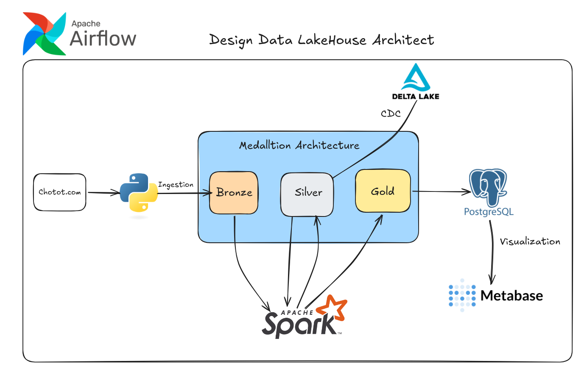
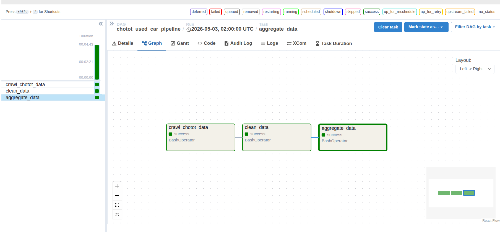
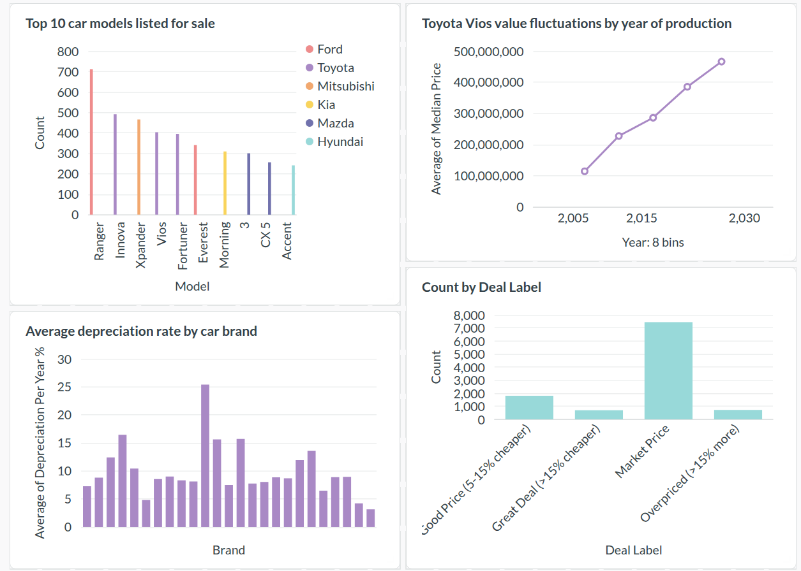

# Used Car Martket Pipeline

An end-to-end data engineering pipeline designed to automatically collect, process, orchestrate, and analyze used car market data from Chotot (Vietnam). The system provides intelligence to identify "good deals", analyze depreciation trends of different car models over time, and segment regional trends.

---

## System Architecture

1. **Crawler**: A scheduled Python script that extracts raw snapshot data recursively from Chotot listings.
2. **Bronze Layer**: Persistent storage of raw, historical CSV dumps.
3. **Silver Layer**: PySpark cleans and standardizes data types. It uses Delta Lake to handle Change Data Capture (CDC) and upsert logic for listing prices and availability.
4. **Gold Layer**: PySpark applies analytical business logic (deal evaluations, depreciation) and loads the final curated dataset into PostgreSQL.
5. **Visualization**: Interactive dashboards loaded in Metabase connected to the Gold PostgreSQL database.



---

## Tech Stack

* **Data Extraction:** Python, BeautifulSoup, Requests, Pandas
* **Data Processing & ETL:** PySpark 
* **Storage Hub:** Delta Lake
* **Data Warehouse / Serving:** PostgreSQL
* **Orchestration:** Apache Airflow
* **Infrastructure:** Docker, Docker Compose
* **Visualization:** Metabase

---

## Project Structure

```text
used_car_data_pipeline/
├── airflow/                 # Airflow DAGs for defining ETL workflows
├── crawler/                 # Python scripts and notebooks for scraping Chotot
├── data/                    # Local storage mock for Data Lake
│   ├── bronze/              # Raw data layer
│   └── silver/              # Cleaned data layer (Delta Lake format)
├── init-db/                 # Postgres initialization scripts
├── jobs/                    # PySpark jobs (Bronze -> Silver -> Gold)
├── utils/                   # Shared configurations and helpers
├── docker-compose.yaml      # Multi-container orchestration setup
└── requirements.txt         # Python package dependencies
```

---

## Business Logic & Features

Based on the highly-curated Gold Layer, this project enables:

* **Deal Finder**: Automatically compares listing prices against the market median and labels cars priced 15% below the market standard as an absolute "Great Deal".
* **Depreciation Analysis**: Calculates the estimated annual depreciation rate (%) for individual car models across varying years of manufacture.
* **Regional Trends**: Ranks the most popular and available car models mapped by province across Vietnam.
* **Recommendation System**: Heuristically scores vehicles based on usage intensity (KM/year) and comparative value within given budget segments.

---

## How to Run

### 1. Clone the repository
```bash
git clone https://github.com/KhanhDo4804/chotot-used-car-data-pipeline.git
cd chotot-used-car-data-pipeline
```

### 2. Start the system
Stand up the entire architecture (Airflow, Spark standalone, PostgreSQL, Metabase) with one command:
```bash
docker-compose up -d
```

### 3. Access Services

Once the containers are healthy, you can monitor and view the pipeline:

* **Airflow UI**: http://localhost:8080
  *(Trigger the DAGs here to start the extraction and ETL process)*
  
  

* **PostgreSQL**: localhost:5432 *(Standard access via pgAdmin/DBeaver)*

* **Metabase**: http://localhost:3001
  *(Connect it to the PostgreSQL data source to visualize insights)*

---

## Dashboard Preview



